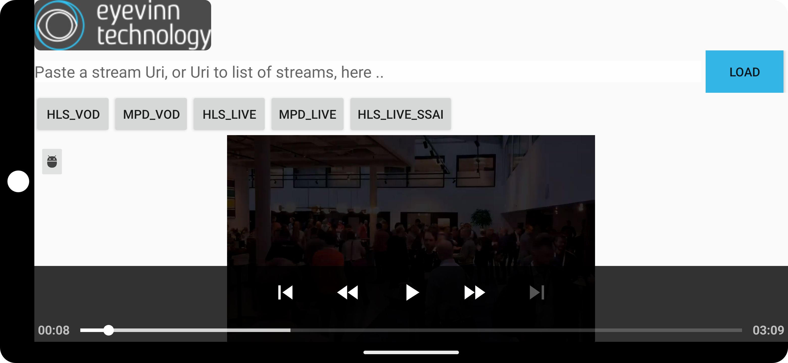

# Eyevinn Android Player
Eyevinn Andriod app for easy testing of HLS and MPEG-dash stream.



## Features
- Set of default streams for testing
- Buttons for selecting any configured stream
- Loading of HLS/dash stream from uri
- Loading of mp4 from uri
- Loading of json list of streams for uri

## Usage
### Loading a video stream
Press any of the buttons to load the corresponding video stream in the player.

### Loading a list of video streams
Enter a uri pointing to a json document on the below format and press `Load`.

```json
{
    "sourceList": [
        {
            "name": "Some test video",
            "url": "test-video-1/master.m3u8",
        },
        {
            "name": "Same video again but force software decoding",
            "url": "test-video-1/master.m3u8",
            "forceSoftwareDecoding": true
        },
        {
            "name": "Test video absolute url",
            "url": "https://some-server/my-viddeo/manifest.mpd"
        }
    ]
}
```
The URIs can be either absolute
or relative. In the latter case they will be resolved against the url the json document was
fetched from.
If the `forceSoftwareDecoding` property is set to `true` for a video, the player will use software
decoding when playing that video. It is also possible to set the `preferExtensionRenderer` property
for a source which will set exoplayer extension renderer mode to `EXTENSION_RENDERER_MODE_PREFER`.

## Development
### Running the app
- Set up the code in the Android studio.
- Create a virtual device in AVD manager.
- Run the application in virtual device.
- Click on HLS or Mpeg-Dash button. 
- Ensure that stream is loaded in player
- Selected stream will be played in the player when play is pressed


### Run tests ##
- Right click on the test and execute it in Android studio.

## Contributing

See [CONTRIBUTING](CONTRIBUTING.md)

## License

This project is licensed under the Apache License v2.0, see [LICENSE](LICENSE)

## Support

Join our [community on Slack](http://slack.streamingtech.se) where you can post any questions regarding any of our open source projects. Eyevinn's consulting business can also offer you:

- Further development of this component
- Customization and integration of this component into your platform
- Support and maintenance agreement

Contact [sales@eyevinn.se](mailto:sales@eyevinn.se) if you are interested.

## About Eyevinn Technology

[Eyevinn Technology](https://www.eyevinntechnology.se) is an independent consultant firm specialized in video and streaming. Independent in a way that we are not commercially tied to any platform or technology vendor. As our way to innovate and push the industry forward we develop proof-of-concepts and tools. The things we learn and the code we write we share with the industry in [blogs](https://dev.to/video) and by open sourcing the code we have written.

Want to know more about Eyevinn and how it is to work here. Contact us at work@eyevinn.se!

